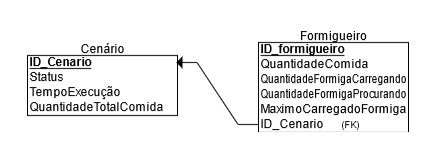

# Novo Modelo

# Definição
    - Tachado -> Pensei que seria necessário, mas depois vi que não era...
    - No ERDplus coloquei cada atributo como INT.

  

## Cenário

- **ID** -> Identificador
- **Status** -> Ativo/Encerrado
- **Tempo Execução** -> Tempo de execução até encerrar, ou até o momento
- **Quantidade Total de Comida** -> Soma de todas as fontes de comida inicialmente

## Formigueiro

- **ID** -> Identificador
- **Quantidade de Comida** -> Quantidade de Comida que já chegou ao formigueiro
- <s>**Quantidade de Formigas** -> Num de formigas do formigueiro.</s>
    - **FormigasCarregando+FormigasProcurando**
- **Formigas Carregando** -> Num formigas do formigueiro que estão carregando comida
- **Formigas Procurando** -> Num formigas do formigueiro que estão procurando comida
- <s>**Média Comida Carregada por Formiga** -> Média dos valores carregados por formiga desse formigueiro</s>
    - **QuantidadeComidaFormigueiro/QuantidadeFormigas**
- **Max Comida Carregada por Formiga** -> Quantidade de comida que a formiga que mais transportou levou até o formigueiro
- **ID_Cenario** -> ligar ao cenário

# Cálculos

    - Tachado -> Não está no escopo do trabalho

## Base

- **Num Cenario** -> *Count(Cenario)*
- **Num Formigueiro** -> *Count(Formigueiro)*
- **Num Formiga** -> *Sum(Formigueiro$FormCarregando)+Sum(Formigueiro$FormProcurando)*
    - **% Carregando** -> *Sum(Formigueiro$FormCarregando)/**NumFormiga***
    - **% Procurando** -> *Sum(Formigueiro$FormProcurando)/**NumFormiga***
- **Num Comida** -> *Sum(Cenario$QuantidadeTotalComida)*
    - **% Formigueiro** -> *Sum(Formigueiro$QuantComida)/**NumComida***
    - **% Transporte** -> *Sum(Formigueiro$FormCarregando)/**NumComida***
    - **% Fonte** -> *100-**%Formigueiro**-**%Transporte***

## Adicional

- **Media Execução** -> *Mean(Cenario$TempoExecução)*
- **Menor Tempo Execução** -> *Min(Cenario$TempoExecução)*
    - Levar o Identificador também
- **Maior Tempo Execução** -> *Max(Cenario$TempoExecução)*
    - Levar o Identificador também
- **Média que uma formiga leva ao formigueiro** -> ***NumComida** $\times$ **%Formigueiro** / **NumFormiga***
- **Max que uma formiga leva ao formigueiro** -> *Max(Formigueiro$MaxComidaCarregadaFormiga)*

## Por Cenário - Adicionar Filtro

- **Num Formigueiro** -> *Cont(Formigueiro)*
- **Num Formiga** -> *Sum(Formigueiro$FormCarregando)+Sum(Formigueiro$FormProcurando)*
    - <s>**% Carregando** -> *Sum(Formigueiro$FormCarregando)/**NumFormiga***
    - **% Procurando** -> *Sum(Formigueiro$FormProcurando)/**NumFormiga***</s>
- **Num Comida** -> *Cenario$QuantidadeTotalComida*
    - <s>**% Formigueiro** -> *Sum(Formigueiro$QuantComida)/**NumComida***
    - **% Transporte** -> *Sum(Formigueiro$FormCarregando)/**NumComida***
    - **% Fonte** -> *100-**%Formigueiro**-**%Transporte***</s>
- **Tempo Execução** -> *Cenário$TempoExecução*

- Por Formigueiro
    - **Num Formiga** -> *Formigueiro$FormCarregando + Formigueiro$FormProcurando*
        - **% Carregando** -> *Formigueiro$FormCarregando/**NumFormiga***
        - **% Procurando** -> *Formigueiro$FormProcurando/**NumFormiga***
    - **Num Comida** -> *Formigueiro$QuantidadeComida + Formigueiro$FormCarregando*
        - **% Transporte** -> *Formigueiro$FormCarregando/**NumComida***
        - **% Formigueiro** -> *Formigueiro$QuantidadeComida/**NumComida***
    - **Probabilidade** -> *Porcentagem da comida comida total no cenario presente no formigueiro*
